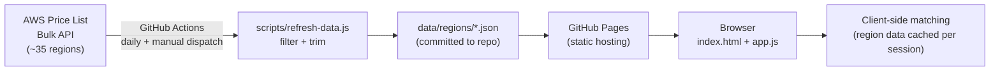

# EC2 Undercut

A static site: pick an AWS region, enter an EC2 instance type (or a whole pasted list, in
bulk mode, or a minimum vCPU/RAM in by-specs mode if you don't have a specific type in
mind), get back current-generation instance types with at least as much vCPU/RAM that
cost less On-Demand in that region — with any extra vCPU/RAM, network/EBS bandwidth,
storage-type, and burstable-CPU differences all flagged. Every search's URL is
shareable. Bulk mode doubles as a fleet cost-report tool: paste or import a
`type,count` list (an actual inventory export works — see docs/SPEC.md for the exact
format) and it totals up current vs. optimized cost across the whole fleet, exportable
as CSV. See [`docs/SPEC.md`](docs/SPEC.md) for the full design and
[`CONTEXT.md`](CONTEXT.md) for
the glossary.

## Architecture

Fully static: a daily GitHub Actions job refreshes the pricing data and commits it,
GitHub Pages serves the site, and everything from there — matching, filtering — runs in
the browser against whatever region's data the user picked. No backend server, no
database, no user accounts.



See [`docs/SPEC.md`](docs/SPEC.md#architecture-adr-0001) for the full breakdown (data
schema, filtering rules, ADR links).

## Running locally

No build step. Just serve the directory statically, e.g.:

```sh
npx serve .
# or: python -m http.server 8000
```

Then open the printed local URL. `data/regions/` is already checked into the repo (one
JSON file per AWS region, refreshed daily by CI), so it works without fetching anything
from AWS yourself.

## Live version

The footer shows "Live version: `<short-sha>`", linked to that commit on GitHub — fetched
client-side from the public GitHub API (`GET /repos/.../commits/main`) on page load, so
it's always the actual current tip of `main`, not something baked in at deploy time (this
site has no build step to bake it in with). No auth token, no server of ours involved.

That API call is unauthenticated and rate-limited (~60 requests/hour per visitor IP), and
some privacy extensions block calls to `api.github.com`. Neither is treated as an error —
the line just stays hidden, same as if `data-freshness` fails to load.

## Analytics

The live site loads [Cloudflare Web Analytics](https://developers.cloudflare.com/web-analytics/)
(`index.html`'s closing `<script>` tag) to track page views — it's cookieless and collects
no personal data. The site token there is a public client-side identifier, not a secret.

Some visitors' traffic won't be counted: `static.cloudflareinsights.com` is on several
ad-blocker/tracking-protection blocklists (EasyPrivacy, Disconnect), so Firefox Enhanced
Tracking Protection and ad-blocker extensions commonly block the beacon request outright
(shows as a CORS-looking console error, but it's really the request never reaching the
network). This is expected and true of any client-side analytics — traffic counts here
are a lower bound, not exact.

## Refreshing the pricing data manually

```sh
node scripts/refresh-data.js
```

This hits the public AWS Price List Bulk API (no AWS credentials needed) once per region
listed in `scripts/regions.js` (~35 regions) and rewrites `data/regions/`. Each region's
raw offer file is several-hundred-MB, fetched one region at a time, so a full run takes
a couple of minutes. `.github/workflows/refresh-data.yml` runs this daily and commits
the result automatically.

## Deploying to GitHub Pages

1. Push this repo to GitHub.
2. In the repo's **Settings → Pages**, set **Source** to "Deploy from a branch", branch
   `main`, folder `/(root)`.
3. That's it — every push to `main` (including the daily automated data-refresh commits)
   redeploys the site automatically. No separate deploy workflow is needed.
